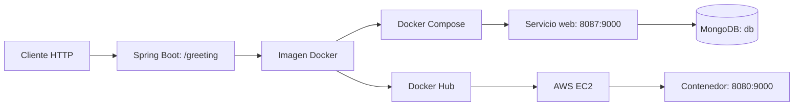

# Virtualization Workshop

## 1. Descripción

Este laboratorio documenta el ciclo de virtualización de una aplicación web Java: desarrollo con Spring Boot, empaquetado con Maven, creación de una imagen Docker, ejecución de múltiples contenedores, orquestación con Docker Compose y MongoDB, publicación en Docker Hub y despliegue en AWS EC2.

La aplicación expone un servicio REST sencillo que permite verificar cada etapa del workshop de forma incremental.

## 2. Tecnologías utilizadas

- Java 21
- Spring Boot 4.1.1
- Maven
- Docker
- Docker Compose
- MongoDB
- Docker Hub
- AWS EC2
- Amazon Linux 2023

## 3. Arquitectura



En Docker Compose, el servicio `web` se conecta al servicio `db` mediante la red interna creada por Compose. La variable `SPRING_DATA_MONGODB_URI` se configura como `mongodb://db:27017/workshop`; el hostname `db` corresponde al nombre del servicio de MongoDB.

## 4. Requisitos

- JDK 21.
- Maven 3.9 o superior.
- Docker Desktop o un motor Docker compatible.
- Docker Compose v2.
- Acceso a Docker Hub para descargar o publicar imágenes cuando corresponda.

El Compose oficial requiere una CPU compatible con AVX, debido a MongoDB 8. En equipos sin AVX debe utilizarse el override local descrito en la sección 9.

## 5. Ejecución local

| Propiedad | Valor |
| --- | --- |
| Group ID | `co.edu.escuelaing` |
| Artifact ID | `virtualization-lab` |
| Version | `1.0.0` |
| Java | `21` |
| Spring Boot | `4.1.1` |
| Dependencia principal | Spring Web |

Primero se construye el JAR:

```powershell
mvn clean package
```

Luego se inicia Spring Boot:

```powershell
mvn spring-boot:run
```

La clase de entrada es `RestServiceApplication` y `HelloRestController` implementa `GET /greeting`.

```powershell
curl.exe "http://localhost:9000/greeting?name=Pedro"
curl.exe "http://localhost:9000/greeting"
```

Las respuestas esperadas son:

```text
Hello, Pedro!
Hello, World!
```

El puerto se obtiene de la variable `PORT`. La configuración `server.port=${PORT:9000}` usa `9000` cuando la variable no está definida. Para probar otro puerto en PowerShell:

```powershell
$env:PORT = 9010
mvn spring-boot:run
```

## 6. Docker

El `Dockerfile` utiliza `amazoncorretto:21`, establece `/app` como directorio de trabajo, copia el JAR como `app.jar`, define `PORT=9000`, expone el puerto `9000` y arranca con `java -jar app.jar`.

Antes de construir la imagen debe existir el JAR en `target/`; por ello se ejecuta primero `mvn clean package`.

```powershell
docker build -t sebastianvillarraga/virtualization-lab:1.0 .
```

Ejemplo de ejecución de un contenedor:

```powershell
docker run -d --name virtualization-lab -e PORT=9000 -p 9000:9000 sebastianvillarraga/virtualization-lab:1.0
```

La imagen publicada corresponde a `sebastianvillarraga/virtualization-lab`.

## 7. Múltiples contenedores

Se ejecutaron tres instancias independientes de la misma imagen:

| Contenedor | Mapeo de puertos |
| --- | --- |
| `virtualization-lab-1` | `34000:9000` |
| `virtualization-lab-2` | `34001:9000` |
| `virtualization-lab-3` | `34002:9000` |

Cada contenedor escucha internamente en `9000`, pero Docker asigna un puerto de host distinto. Esto demuestra aislamiento: los procesos y sus puertos internos no se comparten.

```powershell
docker run -d --name virtualization-lab-1 -e PORT=9000 -p 34000:9000 sebastianvillarraga/virtualization-lab:1.0
docker run -d --name virtualization-lab-2 -e PORT=9000 -p 34001:9000 sebastianvillarraga/virtualization-lab:1.0
docker run -d --name virtualization-lab-3 -e PORT=9000 -p 34002:9000 sebastianvillarraga/virtualization-lab:1.0
```

Los tres endpoints fueron probados correctamente.

## 8. Docker Compose

El archivo oficial `compose.yaml` define:

- `web`: construye la aplicación con `Dockerfile`, usa `PORT=9000`, se expone como `8087:9000` y depende de `db`.
- `db`: utiliza `mongo:8`, se expone como `27017:27017` y usa los volúmenes `mongodb` y `mongodb_config`.

Compose crea una red predeterminada. La URI `mongodb://db:27017/workshop` permite que el servicio web se refiera a MongoDB mediante el nombre del servicio `db`.

En un equipo compatible con AVX, el entorno oficial se inicia con:

```powershell
docker compose up -d --build
```

```powershell
docker compose ps
docker compose logs web
docker compose logs db
```

La aplicación queda disponible en `http://localhost:8087/greeting?name=Compose`.

## 9. Compatibilidad local de MongoDB

La configuración oficial se conserva en `compose.yaml` con `image: mongo:8`. No se modificó para ocultar una limitación del entorno local.

El equipo usado para el laboratorio tiene un **Intel Pentium CPU 6405U @ 2.40GHz**. MongoDB 8 no pudo ejecutarse porque MongoDB 5.0 o posterior requiere soporte AVX. Los logs indicaron:

```text
MongoDB 5.0+ requires a CPU with AVX support
```

Por ello, `compose.local.yaml` existe únicamente como un override local. Conserva nombre de contenedor, puertos, comando y volúmenes del servicio `db`, pero cambia su imagen por `mongo:4.4`, compatible con esta CPU. **MongoDB 4.4 no es una sustitución oficial del workshop**: el requisito oficial continúa siendo MongoDB 8 en `compose.yaml`.

Para combinar los archivos en el equipo local:

```powershell
docker compose -f compose.yaml -f compose.local.yaml up -d
```

```powershell
docker compose -f compose.yaml -f compose.local.yaml config
docker compose -f compose.yaml -f compose.local.yaml ps
```

La configuración resultante para `db` utiliza `image: mongo:4.4`.

Para detener el entorno sin eliminar volúmenes:

```powershell
docker compose -f compose.yaml -f compose.local.yaml stop
```

## 10. Prueba de MongoDB

MongoDB 4.4 se validó con el cliente `mongo`, no con `mongosh`:

```powershell
docker compose -f compose.yaml -f compose.local.yaml exec db mongo
```

Dentro del cliente se ejecutó:

```javascript
show dbs
use workshop
db.messages.insertOne({ message: "Hello from Docker Compose" })
db.messages.find()
```

El documento fue insertado y consultado correctamente. Para salir:

```javascript
exit
```

También se validó la aplicación local en:

```text
http://localhost:8087/greeting?name=Compose
```

con la respuesta:

```text
Hello, Compose!
```

## 11. Docker Hub

El repositorio publicado es [`sebastianvillarraga/virtualization-lab`](https://hub.docker.com/r/sebastianvillarraga/virtualization-lab). Los tags publicados correctamente son:

- `1.0`
- `latest`

```powershell
docker tag sebastianvillarraga/virtualization-lab:1.0 sebastianvillarraga/virtualization-lab:latest
docker push sebastianvillarraga/virtualization-lab:1.0
docker push sebastianvillarraga/virtualization-lab:latest
```

La autenticación en Docker Hub debe realizarse previamente en el equipo del usuario. Este repositorio no contiene credenciales ni tokens.

## 12. AWS EC2

Se creó una instancia llamada `virtualization-workshop`:

| Propiedad | Valor |
| --- | --- |
| Sistema operativo | Amazon Linux 2023 |
| Arquitectura | `x86_64` |
| Tipo de instancia | `t3.micro` |
| Almacenamiento | 8 GiB `gp3` |

El Security Group se configuró con SSH TCP `22` restringido a la IP del usuario y TCP `8080` abierto para la aplicación. En la instancia se instaló Docker, se descargó la imagen y se creó el contenedor:

```bash
docker pull sebastianvillarraga/virtualization-lab:1.0
docker run -d \
  --name virtualization-lab \
  --restart unless-stopped \
  -e PORT=9000 \
  -p 8080:9000 \
  sebastianvillarraga/virtualization-lab:1.0
```

```bash
docker ps
```

El contenedor mostró el mapeo `0.0.0.0:8080->9000/tcp`. Los logs confirmaron el arranque de Spring Boot y Tomcat escuchando en el puerto `9000` dentro del contenedor.

## 13. Prueba del deployment

Durante las pruebas se utilizó la IP pública `54.242.15.125`:

```text
http://54.242.15.125:8080/greeting?name=AWS
```

La respuesta fue:

```text
Hello, AWS!
```

La IP pública no debe considerarse permanente; puede cambiar si la instancia se detiene y se inicia nuevamente.

## 14. Verificación

| Componente | Prueba | Resultado |
| --- | --- | --- |
| Spring Boot | `GET /greeting` | OK |
| Docker | `docker images` | OK |
| Contenedores independientes | Puertos `34000`, `34001` y `34002` | OK |
| Docker Compose local | Servicios `web` y `db` | OK |
| MongoDB 4.4 local | `insertOne` y `find` | OK |
| Docker Hub | Tags `1.0` y `latest` | OK |
| AWS EC2 | Endpoint publicado en `8080` | OK |

## 15. Problemas encontrados y soluciones

1. **MongoDB 8 sin AVX.** MongoDB 8 falló en el Intel Pentium 6405U porque MongoDB 5.0 o posterior requiere AVX. La adaptación local fue usar `mongo:4.4` mediante un override.
2. **Necesidad de `compose.local.yaml`.** El workshop exige `mongo:8`, por lo que `compose.yaml` no se alteró. El archivo local se combina con `-f compose.yaml -f compose.local.yaml`.
3. **Cliente de MongoDB 4.4.** La imagen `mongo:4.4` utiliza `mongo` en lugar de `mongosh`.
4. **Permisos iniciales del archivo `.pem` en Windows.** Fue necesario ajustar los permisos de la clave para que solo el usuario autorizado pudiera leerla. No se incluyen archivos `.pem` ni claves privadas en este repositorio.
5. **Regla SSH del Security Group.** SSH se restringió a la IP del usuario, en lugar de exponerse públicamente. El puerto `8080` se abrió para comprobar la aplicación.

## 16. Costos AWS

El análisis de costos queda preparado para completarse con tarifas vigentes de la región AWS usada. El repositorio no contiene la región ni los precios aplicables, por lo cual no se incluyen cifras.

Para calcularlo se deben considerar:

- Tiempo de ejecución de EC2 `t3.micro`.
- Volumen EBS `gp3` de 8 GiB y operaciones asociadas.
- Transferencia de datos de entrada y salida.
- Direcciones IP públicas, cuando apliquen cargos por asignación y tiempo de uso.
- Servicios adicionales que puedan estar habilitados en la cuenta.

## 17. Conclusiones

El workshop permitió empaquetar una aplicación Spring Boot con Java 21, aislarla en Docker, orquestarla con Docker Compose y MongoDB, publicarla en Docker Hub y desplegarla en AWS EC2. La separación entre `compose.yaml` oficial y `compose.local.yaml` preserva MongoDB 8 como requisito del laboratorio y permite validarlo localmente en una CPU sin AVX.

## Evidencias

El repositorio no contiene capturas de pantalla ni archivos de evidencia visual. Se deben incorporar posteriormente evidencias reales de:

- Respuestas de `/greeting` localmente, en los tres contenedores y en EC2.
- `docker images` y `docker ps`.
- Estado y logs de Docker Compose.
- Inserción y consulta de MongoDB.
- Repositorio y tags de Docker Hub.
- Endpoint desplegado en EC2.
